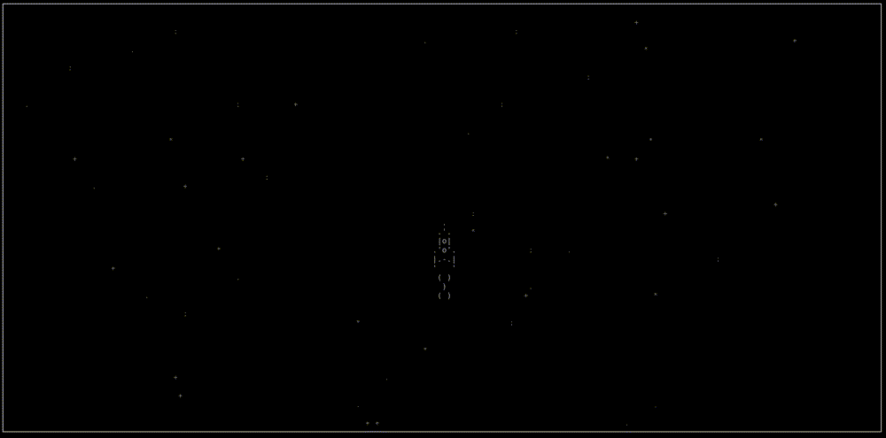

# Shooting Rocket

This is a simple action game (still under development) written in asynchronus Python using the `ncurses` library, which creates a pseudo-graphical interface.

## Gameplay

You control a spaceship rocket and shoot space garbage accumulated on the orbit.

Presently you can only control the rocket with a keyboard, but the shooting function has not yet been implemented, neither is the orbit garbage. But all this is coming soon!

## Getting the game

Pre-requisites:

- Git installed on your system.

On Linux or Mac:

- Launch your terminal emulator
- Go to the directory you want to download the game to
- Issue the command

      git clone git@github.com:hyperfield/shooting_rocket.git

  or

      git clone https://github.com/hyperfield/shooting_rocket.git

You will have the Shooting Rocket files downloaded to your disk.

On Windows:

- Run `cmd.exe` or Power Shell
- Do the same steps as above

or

- Use the graphical shell for GitHub.

## Running the game

Pre-requisites:

- Python 3 installed on your system.

On Linux, Mac or Windows:

- Launch a terminal emulator
- Go to the game directory
- Issue the command

      python3 main.py
